I'm Arvind, a Rustacean and Arch Linux User (btw). I'm interested in:
<ul style="width: 25%; margin-left: auto; margin-right: auto; text-align: center;">
  <li> Machine Learning </li>
  <li>Computational Linguistics</li>
  <li>Epidemiology</li>
  <li>Music Theory</li>
  <li>Discrete Mathematics</li>
</ul>

## My [Diet](https://github.com/Quantalabs/diet) 🍔
> The research papers that I've been consuming lately.

<!-- BEGIN CITE -->
- Polykovskiy, D., Zhebrak, A., Sanchez-Lengeling, B., Golovanov, S., Tatanov, O., Belyaev, S., Kurbanov, R., Artamonov, A., Aladinskiy, V., Veselov, M., Kadurin, A., Johansson, S., Chen, H., Nikolenko, S., Aspuru-Guzik, A., & Zhavoronkov, A. (2020). Molecular Sets (MOSES): A Benchmarking Platform for Molecular Generation Models. Frontiers in Pharmacology, 11. https://doi.org/10.3389/fphar.2020.565644

- Zhou, J., & Sander, J. (2003). Data Bubbles for Non-Vector Data. In Proceedings 2003 VLDB Conference (pp. 452–463). Elsevier. https://doi.org/10.1016/b978-012722442-8/50047-1

- Bhola, I. (2023). Dialectal Variation and Mutual Intelligibility of Hindi in Delhi. International Journal of Languages and Culture, 3(2), 55–64. https://doi.org/10.51483/ijlc.3.2.2023.55-64

- Díaz, M., & Switkes, J. (2021). Speaking out: A mathematical model of language preservation. Heliyon, 7(5), e06975. https://doi.org/10.1016/j.heliyon.2021.e06975

- Abrams, D. M., & Strogatz, S. H. (2003). Modelling the dynamics of language death. Nature, 424(6951), 900–900. https://doi.org/10.1038/424900a

- Satyendra, R. (2004). An Informal Introduction to Some Formal Concepts from Lewin’s Transformational Theory. Journal of Music Theory, 48(1), 99–141. https://doi.org/10.1215/00222909-48-1-99

<!-- END CITE -->

 

  

<table><tr><td></td><td>
If I were a Springer-Verlag Graduate Text in Mathematics, I would be Bela Bollobas's <b><i>Modern Graph Theory</i></b>.

I am an in-depth account of graph theory, written with the student in mind; I reflect the current state of the subject and emphasize connections with other branches of pure mathematics.   Recognizing that graph theory is one of several courses competing for the attention of a student, I contain extensive descriptive passages designed to convey the flavor of the subject and to arouse interest.

Which Springer GTM would <i>you</i> be? <a href="http://math.jhu.edu/~savitt/GTM.html">The Springer GTM Test</a>
</td></tr></table>
