I'm Arvind, a Rustacean and Arch Linux User (btw). I'm interested in:
<ul style="width: 25%; margin-left: auto; margin-right: auto; text-align: center;">
  <li> Machine Learning </li>
  <li>Computational Linguistics</li>
  <li>Epidemiology</li>
  <li>Music Theory</li>
  <li>Discrete Mathematics</li>
</ul>

## My Diet 🍔
> The research papers that I've been consuming lately.

<!-- BEGIN CITE -->
- Xin, H., Ren, Z. Z., Song, J., Shao, Z., Zhao, W., Wang, H., Liu, B., Zhang, L., Lu, X., Du, Q., Gao, W., Zhu, Q., Yang, D., Gou, Z., Wu, Z. F., Luo, F., & Ruan, C. (2024). DeepSeek-Prover-V1.5: Harnessing Proof Assistant Feedback for Reinforcement Learning and Monte-Carlo Tree Search (Version 1). arXiv. https://doi.org/10.48550/ARXIV.2408.08152

- Gallegos, I. O., Rossi, R. A., Barrow, J., Tanjim, M. M., Kim, S., Dernoncourt, F., Yu, T., Zhang, R., & Ahmed, N. K. (2024). Bias and Fairness in Large Language Models: A Survey. Computational Linguistics, 50(3), 1097–1179. https://doi.org/10.1162/coli_a_00524

- Fiore, T. M., & Noll, T. (2011). Commuting Groups and the Topos of Triads (Version 2). arXiv. https://doi.org/10.48550/ARXIV.1102.1496

- Lo, Y.-C., Rensi, S. E., Torng, W., & Altman, R. B. (2018). Machine learning in chemoinformatics and drug discovery. Drug Discovery Today, 23(8), 1538–1546. https://doi.org/10.1016/j.drudis.2018.05.010

<!-- END CITE -->

 

  

<table><tr><td></td><td>
If I were a Springer-Verlag Graduate Text in Mathematics, I would be Bela Bollobas's <b><i>Modern Graph Theory</i></b>.

I am an in-depth account of graph theory, written with the student in mind; I reflect the current state of the subject and emphasize connections with other branches of pure mathematics.   Recognizing that graph theory is one of several courses competing for the attention of a student, I contain extensive descriptive passages designed to convey the flavor of the subject and to arouse interest.

Which Springer GTM would <i>you</i> be? <a href="http://math.jhu.edu/~savitt/GTM.html">The Springer GTM Test</a>
</td></tr></table>
